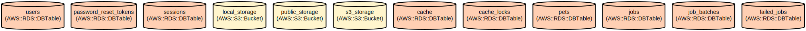

# Pet Adoption Management System - Streamline Pet Shelter Operations and Adoptions

A comprehensive Laravel-based web application that manages pet shelter operations, adoption processes, and payments. This system enables shelter managers to list pets, process adoption applications, and handle payments while providing potential adopters with an easy way to browse pets and submit adoption requests.

The application features role-based access control with three user types (admin, manager, and user), secure authentication, pet photo management, and integrated payment processing. Built with Laravel 12.0, it leverages modern PHP practices and provides a robust foundation for pet shelter management.

## Repository Structure
```
.
├── app/                          # Application core code
│   ├── Http/                     # HTTP layer (controllers, middleware)
│   │   ├── Controllers/         # Application controllers for auth and pets
│   │   └── Middleware/          # Custom middleware including role-based access
│   └── Models/                  # Eloquent models for core entities
├── config/                      # Configuration files
├── database/                    # Database migrations and seeders
│   ├── factories/              # Model factories for testing
│   ├── migrations/             # Database structure definitions
│   └── seeders/               # Database seeders
├── resources/                   # Frontend resources
│   ├── css/                    # Stylesheets including Tailwind CSS
│   ├── js/                     # JavaScript files
│   └── views/                  # Blade templates
└── routes/                     # Application routes
    ├── console.php            # Console commands
    └── web.php               # Web routes
```

## Usage Instructions
### Prerequisites
- PHP >= 8.2
- Composer
- Node.js & NPM
- MySQL/MariaDB/PostgreSQL
- Redis (optional, for caching)

### Installation

1. Clone the repository:
```bash
git clone <repository-url>
cd pet-adoption-system
```

2. Install PHP dependencies:
```bash
composer install
```

3. Install frontend dependencies:
```bash
npm install
```

4. Configure environment:
```bash
cp .env.example .env
php artisan key:generate
```

5. Configure database in .env:
```
DB_CONNECTION=mysql
DB_HOST=127.0.0.1
DB_PORT=3306
DB_DATABASE=pet_adoption
DB_USERNAME=root
DB_PASSWORD=
```

6. Run migrations:
```bash
php artisan migrate
```

7. Create storage link:
```bash
php artisan storage:link
```

### Quick Start

1. Start the development server:
```bash
php artisan serve
```

2. Start the Vite development server:
```bash
npm run dev
```

3. Access the application at `http://localhost:8000`

### More Detailed Examples

1. User Registration:
```php
POST /register
{
    "name": "John Doe",
    "email": "john@example.com",
    "phone": "1234567890",
    "password": "password",
    "password_confirmation": "password"
}
```

2. Pet Listing:
```php
POST /pets
{
    "name": "Max",
    "species": "Dog",
    "breed": "Labrador",
    "age": 2,
    "description": "Friendly and energetic",
    "photo_url": "pets/max.jpg"
}
```

### Troubleshooting

1. Storage Permission Issues
```bash
# Set proper permissions for storage directory
chmod -R 775 storage
chmod -R 775 bootstrap/cache
```

2. Database Connection Issues
- Verify database credentials in .env
- Ensure database service is running
- Check for proper database user permissions

3. Asset Loading Issues
```bash
# Clear application cache
php artisan cache:clear
php artisan config:clear
php artisan view:clear
```

## Data Flow

The application follows a standard MVC architecture with additional layers for authorization and payment processing.

```ascii
User Request → Router → Middleware (Auth/Role) → Controller → Model ↔ Database
     ↑                                             ↓
     └─────────────────────── Response ←─── View/JSON
```

Key component interactions:
1. Authentication flow handles user registration and login
2. Role middleware validates user permissions for protected routes
3. Pet listings are managed through PetController and Pet model
4. Adoption applications link users, pets, and payments
5. File storage handles pet photos through configured filesystem
6. Payment processing integrates with external payment services
7. Session management tracks user state and permissions

## Infrastructure



### Database Tables
- `users`: Stores user accounts with role-based access control
- `pets`: Manages pet listings and availability
- `adoption_applications`: Tracks adoption requests and status
- `payments`: Records payment transactions
- `sessions`: Manages user sessions
- `cache`: Handles application caching
- `jobs`: Manages background processing queue

### File Storage
- Local disk configured for private storage
- Public disk for user-accessible files
- Optional S3 integration for scalable storage
- Symbolic link from public/storage to storage/app/public